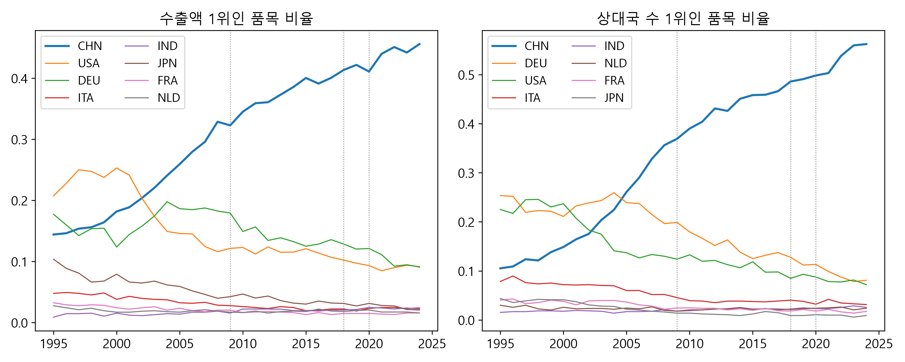
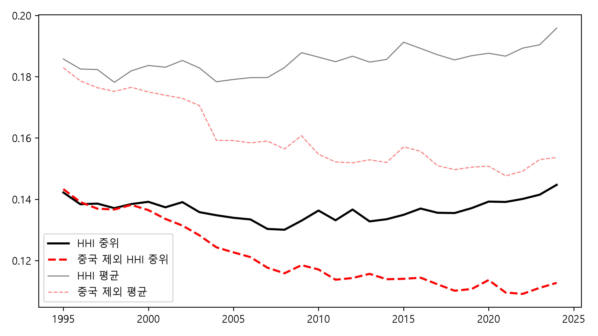
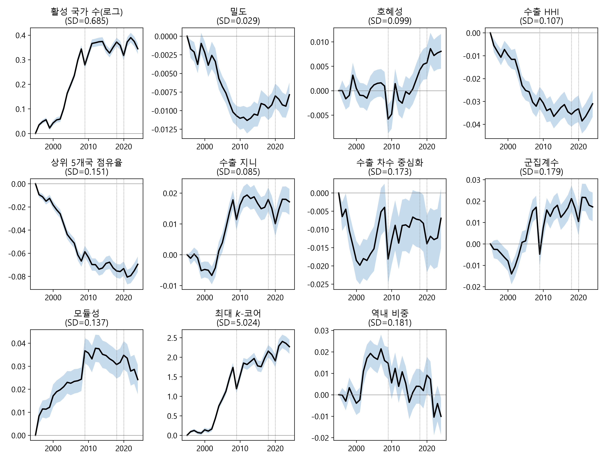
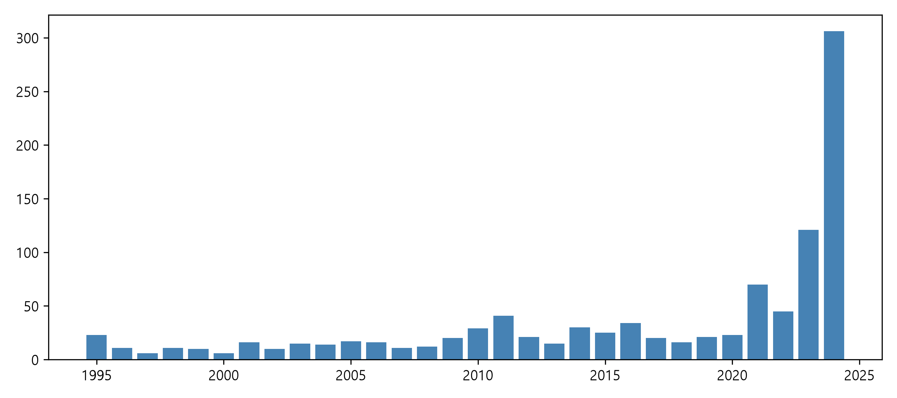
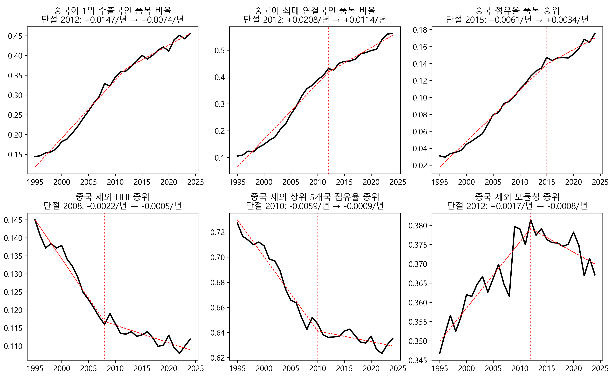

# 중국 허브화와 세계 교역 네트워크, 1995\~2024

BACI 품목별 네트워크 지표로 본 장기 특징과 전환의 시점

작성일: 2026-09-14
자료: BACI HS92 V202601 (CEPII, 2026-01-30 공개; Gaulier and Zignago, 2010). 라이선스 Etalab 2.0.
재현: 이 폴더의 `analysis.ipynb`. 입력 DB는 저장소의 `scripts/01`\~`04`가 만든다. 그림은 이 문서 옆 `img/` 폴더에 있다. 지표 정의는 부록 A에, 자세한 설명과 수식은 해설 문서 [교역 네트워크를 읽는 지표](../network-theory/paper.md)에 있다.

## 요약

1995년부터 2024년까지 품목별 세계 교역 네트워크의 전체 지표는 허브화(hub formation)를 가리킨다. 수출 차수 중심화와 수출 지니계수가 올랐고 역내 교역 비중은 내렸다. 그러나 이 변화는 중국 한 노드가 거의 모든 품목의 허브가 된 결과다. 2024년 중국은 HS4 1,241개 호의 45.6%에서 수출액 1위, 56.2%에서 수출 상대국 수 1위다(1995년에는 각각 14.4%, 10.5%). 중국을 노드에서 제외하면 허브화와 탈지역화 추세는 사라지고, 수출 집중도(HHI)와 상위 5개국 점유율은 뚜렷이 낮아지며 모듈성은 높아진다. 중국을 제외한 세계는 30년 동안 탈집중·블록화했다.

이 추세에 변화가 생긴 시점은 세 가지로 구분된다. 중국 허브화의 속도는 2012년을 단절점으로 절반으로 줄었고, 2015\~2019년에는 품목 중위 점유율이 변하지 않다가 2020년 이후 다시 올랐다. 품목 단위에서는 중국 점유율이 정점을 지난 호가 41%(415개)인데, 농식품·광물·목재는 2007\~2014년에, 신발·가죽·섬유는 2012\~2017년에 정점을 지났고, 기계·전기·화학·플라스틱은 아직 상승하고 있다. 한편 중국을 제외한 세계의 탈집중은 2008\~2012년에 멈췄고, 모듈성은 2012년 이후 낮아지고 있다.

## I. 자료와 방법

- **자료.** BACI HS92 판의 1995\~2024년 자료로, 수출국·수입국·HS6·연도마다 한 행씩 모두 2억 6,989만 행이다. BACI는 UN Comtrade의 수출국 보고와 수입국 보고를 조정해 하나의 값으로 만든 자료이며 원산지 기준(country of origin)이다. 2024년 값은 잠정치다.
- **네트워크.** HS4 호(1,241개)마다 연도별로 국가를 노드(node), 수출국에서 수입국으로 가는 흐름을 엣지(edge)로 하는 방향 그래프(directed graph)를 만들었다. 엣지의 가중치는 달러 금액이다. 노드는 30년 내내 수출과 수입이 모두 있는 207개국으로 고정했고(고정 국가군, balanced panel of countries), 100만 달러 미만 흐름은 가중치 임곗값(weight threshold)으로 제외했다. 이 조건의 네트워크를 이 보고서의 주 사양으로 삼는다. 이 임곗값은 명목 금액이라 실질 기준으로는 해마다 낮아지므로, 1995년 불변가격 100만 달러를 미국 소비자물가지수(CPI-U)로 해마다 환산한 실질 임곗값(2024년 약 206만 달러)으로도 같은 지표를 계산했다. 사양별 코드 이름은 부록 B에 정리했다.
- **중국 제외.** 같은 조건에서 중국 노드와 중국에 연결된 엣지를 모두 제거한 네트워크를 따로 계산했다. 점유율은 남은 국가들 사이에서 다시 정규화(renormalization)된다.
- **지표.** 활성 국가 수(active nodes), 밀도(density), 호혜성(reciprocity), 수출 HHI (Herfindahl–Hirschman index), 상위 5개국 점유율(top-5 share), 수출 지니계수(Gini coefficient), 수출 차수 중심화(export degree centralization), 군집계수(clustering coefficient), 모듈성(modularity, Leiden 알고리즘), 최대 $`k`$-코어($`k`$-core), 역내 비중(intra-regional trade share). 정의는 부록 A에 있다.
- **검정.** 품목 고정효과(product fixed effects) 패널(1,203호 × 30년 = 36,090행, 품목 군집 표준오차 clustered by product)로 선형추세(linear trend)를 추정했다. 전환 시점은 연도별 품목 중위 시계열에 단일 기울기 단절점(single slope break; 연속 구간선형 continuous piecewise linear, 오차제곱합 최소)을 적합해 구했고, 품목별로는 중국 점유율 3년 이동평균(3-year moving average)의 정점 연도(peak year)를 구했다. 노드 고정을 풀거나, 임곗값을 없애거나, 실질 임곗값을 써도 핵심 결과(수출 차수 중심화, 지니, $`k`$-코어의 상승과 역내 비중의 하락)의 방향은 같다. 밀도, 호혜성, 상위 5개국 점유율은 사양에 따라 부호나 유의성이 달라진다(부록 B).

추세 검정에서는 품목 $`p`$의 $`t`$년 지표값 $`y_{pt}`$에 대해 다음 모형을 추정했다.

```math
y_{pt} = \alpha_p + \beta \, \frac{t - 1995}{10} + \varepsilon_{pt}
```

$`\alpha_p`$는 품목 고정효과이고, $`\beta`$는 10년당 추세다. 지표마다 단위가 다르므로 본문의 표는 $`\beta`$를 그 지표의 표준편차로 나눈 $`\beta/\mathrm{SD}`$를 보인다. 표준편차는 모든 품목과 연도에 걸쳐 계산했고, 활성 국가 수는 로그를 취해 추정했다.

## II. 전체 지표의 30년

다음 표는 HS4 호마다 계산한 지표의 1995년과 2024년 중위값, 그리고 품목 고정효과 패널로 추정한 10년당 추세를 표준편차 단위($`\beta/\mathrm{SD}`$)로 보인 것이다. 별표는 유의수준을 나타낸다(* 10%, ** 5%, *** 1%).

| 지표 | 1995 | 2024 | 10년당 추세 $`\beta/\mathrm{SD}`$ |
|---|---|---|---|
| 활성 국가 수 | 50 | 81 | +0.27*** |
| 밀도 | 0.063 | 0.050 | −0.17*** |
| 호혜성 | 0.156 | 0.154 | +0.02*** |
| 수출 HHI | 0.142 | 0.145 | +0.04*** |
| 상위 5개국 점유율 | 0.717 | 0.697 | −0.06*** |
| 수출 지니 | 0.826 | 0.878 | +0.26*** |
| 수출 차수 중심화 | 0.433 | 0.583 | +0.24*** |
| 군집계수 | 0.398 | 0.463 | +0.13*** |
| 모듈성 | 0.348 | 0.325 | −0.06*** |
| 최대 $`k`$-코어 | 6 | 8 | +0.21*** |
| 역내 비중 | 0.614 | 0.538 | −0.13*** |

가장 큰 변화는 수출 차수 중심화와 수출 지니의 상승이다. 품목마다 한 수출국이 거의 모든 수입국과 연결되었고, 수출액 분포에서 최상위 수출국의 비중이 커졌다. 역내 비중은 낮아져 지역 간 교역의 비중이 커졌다. 활성 국가 수는 늘었으나 밀도는 낮아졌는데, 새로 참여한 나라들이 소수의 상대국과만 거래하기 때문이다. 다만 활성 국가 수 증가의 약 절반은 명목 임곗값의 실질 가치가 낮아진 효과이며, 실질 임곗값을 쓰면 2024년 중위값은 66개국이다(VI장). 수출 HHI의 추세는 작다. 지니와 중심화가 크게 오르는 동안 HHI는 거의 일정했으며, 그 이유는 III장에서 설명한다.

이 변화의 대부분은 2002\~2010년에 일어났다. 연도 고정효과(year fixed effects) 곡선에서 지니, 중심화, $`k`$-코어, 활성 국가 수는 2002년부터 가파르게 오르다가 2009년 한 해 하락했고(30년 가운데 가장 큰 연간 변화), 2010년 이후에는 상승 속도가 느려졌다. 2018년 미중 관세 전후로는 이 지표들의 추이에 뚜렷한 변화가 없다. 2020년에는 짧게 하락한 뒤 회복했으며, 회복한 수준이 이전 최고치를 넘는지는 중국을 포함하는지에 따라 다르다(V장).


*그림 1. 지표별 연도 고정효과(1995=0)와 95% 신뢰구간. HS4 1,203개 호, 고정 207개국, 품목 군집 표준오차.*

## III. 허브 국가

품목마다 수출액이 가장 큰 나라와 수출 상대국 수가 가장 많은 나라(최대 연결국, most-connected exporter)를 구하고, 각 나라가 1위인 품목의 비율을 연도별로 세었다. 다음 표는 그 비율을 1995, 2005, 2015, 2024년에 대해 주요국별로 보인 것이다.

| 연도 | 수출액 1위 품목 비율: 중국 | 미국 | 독일 | 일본 | 상대국 수 1위 품목 비율: 중국 | 독일 | 미국 |
|---|---|---|---|---|---|---|---|
| 1995 | 14.4% | 20.7% | 17.7% | 10.4% | 10.5% | 25.3% | 22.5% |
| 2005 | 25.9% | 14.6% | 18.6% | 5.9% | 26.1% | 23.9% | 13.7% |
| 2015 | 40.0% | 12.1% | 12.5% | 3.0% | 45.8% | 12.5% | 11.8% |
| 2024 | 45.6% | 9.2% | 9.1% | 2.1% | 56.2% | 8.1% | 7.2% |

차수 중심화의 상승은 중국이 최대 연결국인 품목이 늘어난 결과다. 1995년에는 독일과 미국이 각각 품목의 약 4분의 1에서 최대 연결국이었으나, 2024년에는 중국이 최대 연결국인 품목이 절반을 넘는다. 중국 점유율의 품목 중위값은 1.8%에서 15.8%로 올랐다.



*그림 2. 품목별 수출액 1위(왼쪽)와 수출 상대국 수 1위(오른쪽)인 품목의 비율. 점선은 2009·2018·2020년.*

수출 HHI가 거의 일정했던 이유는 국가별 분해에서 드러난다. 품목 평균 HHI의 변화(1995\~97년 평균에서 2022\~24년 평균까지)는 +0.0007에 불과한데, 중국의 기여는 +0.056이고 미국(−0.019)·독일(−0.012)·일본(−0.008)·이탈리아·캐나다·영국의 기여는 합쳐 −0.052다. 중국의 점유율 상승분만큼 기존 선진 수출국의 점유율이 낮아졌다. 지니와 중심화는 최상위 한 노드의 비중 변화에 HHI보다 민감하므로 크게 올랐다.



*그림 3. 수출 HHI의 품목 중위·평균, 실제(검정)와 중국을 뺀 뒤 재정규화한 값(빨강).*

## IV. 중국을 제외한 세계

다음 표는 같은 지표를 중국 노드 없이 다시 계산해, 10년당 추세($`\beta/\mathrm{SD}`$)를 중국을 포함한 경우와 비교한 것이다. 판정 열에는 중국을 제외했을 때 추세가 어떻게 달라졌는지를 적었고, 마지막 열은 중국을 제외한 네트워크를 실질 임곗값으로 다시 계산한 결과다.

| 지표 | 중국 포함 | 중국 제외 | 판정 | 중국 제외, 실질 임곗값 |
|---|---|---|---|---|
| 수출 차수 중심화 | +0.24*** | 0.00 (n.s.) | 사라짐 | −0.03*** |
| 역내 비중 | −0.13*** | −0.01 (n.s.) | 사라짐 | −0.01 (n.s.) |
| 수출 HHI | +0.04*** | −0.11*** | 반전 | −0.06*** |
| 모듈성 | −0.06*** | +0.06*** | 반전 | +0.07*** |
| 상위 5개국 점유율 | −0.06*** | −0.18*** | 하락 강화 | −0.13*** |
| 수출 지니 | +0.26*** | +0.10*** | 4할로 축소 | +0.01 (n.s.) |
| 군집계수 | +0.13*** | +0.06*** | 절반 | −0.02** |
| 최대 $`k`$-코어 | +0.21*** | +0.19*** | 유지 | +0.09*** |
| 활성 국가 수(로그) | +0.27*** | +0.21*** | 유지 | +0.10*** |
| 밀도 | −0.17*** | −0.11*** | 유지 | −0.07*** |

HS2 수준(96개 류)에서도 결과는 같다. 중심화의 추세는 +0.38에서 +0.11로 줄고, 지니는 유의하지 않게 되며, HHI와 모듈성은 부호가 바뀐다. 중국을 제외하면 30년 동안의 허브화(hub formation)와 탈지역화는 나타나지 않는다. 중국 제외 역내 비중은 2007년까지 오히려 올랐다가 그 뒤 낮아져 1995년 수준이고, 중국 제외 차수 중심화는 1995\~2001년에 낮아졌다가 2008년까지 1995년 수준으로 돌아온 뒤 거의 일정하다. 반면 수출 HHI와 상위 5개국 점유율은 뚜렷이 낮아졌고 모듈성은 높아졌다. 중국을 제외한 세계에서는 수출이 더 많은 나라로 나뉘고 블록 구조가 뚜렷해졌다.



*그림 4. 그림 1과 같은 연도 고정효과를 중국 노드를 뺀 네트워크에서 다시 계산한 것.*

중국을 제외해도 남는 변화는 핵심부(core)의 심화($`k`$-코어), 주변부(periphery)의 확장(활성 국가 수), 작은 품목의 밀도 하락, 그리고 지니 상승의 일부다. 그러나 실질 임곗값으로 다시 계산하면 $`k`$-코어와 활성 국가 수의 추세는 절반가량으로 줄고(+0.19에서 +0.09, +0.21에서 +0.10), 지니의 추세는 +0.01로 유의하지 않게 되며, 군집계수는 −0.02로 부호가 바뀐다. 명목 임곗값에서 남던 지니 상승은 2003\~2009년에 집중되어 있어 중국 부상기에 중간 규모 수출국의 점유율이 줄어든 결과로 해석할 여지가 있었으나, 실질 임곗값에서는 사라지므로 이 해석은 유보한다. 반면 중국을 제외한 세계에서 수출 HHI (−0.06)와 상위 5개국 점유율(−0.13)이 낮아지고 모듈성(+0.07)이 높아진 결과는 실질 임곗값에서도 유지된다. 따라서 II장의 결론은 다음과 같이 고쳐 써야 한다. 세계 교역 네트워크 전체가 허브화한 것이 아니라, 중국 한 노드가 거의 모든 품목의 허브가 되면서 전체 지표가 그렇게 나타났고, 중국을 제외한 세계에서는 탈집중(deconcentration)과 블록화(bloc formation)가 진행되었다.

## V. 변화의 시점

### 1. 중국 허브화의 감속: 2012년, 그리고 2015\~2019년의 정체

다음 표는 중국 허브화를 나타내는 네 계열에 단일 기울기 단절점을 적합한 결과다. 계열마다 오차제곱합이 가장 작은 단절 연도와 그 전후의 연간 기울기를 보인다.

| 계열 | 단절 연도 | 이전 기울기(연) | 이후 기울기(연) |
|---|---|---|---|
| 중국이 1위 수출국인 품목 비율 | 2012 | +1.47%p | +0.74%p |
| 중국이 최대 연결국인 품목 비율 | 2012 | +2.08%p | +1.14%p |
| 중국 점유율 품목 중위 | 2015 | +0.61%p | +0.34%p |
| 중국 점유율 품목 평균 | 2011 | +0.65%p | +0.24%p |

그다음 표는 5년 구간마다 중국이 1위 수출국인 품목 비율과 중국 점유율 품목 중위값이 얼마나 변했는지, 그리고 그 구간에 중국이 1위를 새로 얻거나 잃은 품목 수를 보인 것이다.

| 구간 | 1위 품목 비율 변화 | 중국 점유율 중위 변화 | 1위 획득 | 1위 상실 | 순증 |
|---|---|---|---|---|---|
| 1995\~2000 | +3.8%p | +1.4%p | 103 | 56 | +47 |
| 2000\~2005 | +7.7%p | +3.5%p | 160 | 65 | +95 |
| 2005\~2010 | +8.6%p | +3.0%p | 188 | 87 | +101 |
| 2010\~2015 | +5.5%p | +3.7%p | 160 | 91 | +69 |
| 2015\~2019 | +2.1%p | −0.1%p | 116 | 94 | +22 |
| 2019\~2024 | +3.4%p | +2.9%p | 186 | 146 | +40 |

중국 허브화의 속도는 2012년 전후로 절반이 되었다. 2015\~2019년에는 품목 중위 점유율이 변하지 않았고 1위 순증도 22개로 가장 적었다. 2020년 이후 점유율은 다시 올랐으나 1위 상실도 146개로 30년 가운데 가장 많다. 중국이 새로 1위가 되는 품목과 함께 1위를 잃는 품목도 늘어난 것이다. 2019년에 중국이 1위였다가 2024년에 1위가 아닌 37개 호에서 1위는 이탈리아·독일·베트남·미국·인도·모로코·브라질·방글라데시로 바뀌었다.

### 2. 품목 수준의 정점 통과: 1차산품에서 노동집약 소비재로

중국 점유율이 한 번이라도 5%를 넘은 1,015개 호에서 점유율 3년 이동평균의 정점 연도를 구했다. 2024년 값이 정점의 90% 아래이고 정점이 2021년 이전인 호를 *정점 통과*(past peak)로 분류했다. 정점 통과 호는 415개(41%)이고, 정점이 2022년 이후라 아직 상승하고 있는 호는 472개(47%)다. 정점 연도는 2010\~2016년에 한 무리(연 20\~34개), 2021\~2024년에 큰 무리(2023년 121개, 2024년 306개)를 이룬다.



*그림 6. 품목별 중국 점유율(3년 이동평균)의 정점 연도 분포. 점유율이 한 번이라도 5%를 넘은 1,015개 호.*

다음 표는 HS 부(section)별로 정점 연도의 중위값, 정점 통과 호와 아직 상승 중인 호의 비율, 2024년 중국 점유율의 중위값을 정점 통과 비율이 높은 순서로 보인 것이다.

| 부 | 품목 수 | 정점 연도 중위 | 정점 통과 | 아직 상승 중 | 2024 중국 점유율 중위 |
|---|---|---|---|---|---|
| 동물성 생산품 | 25 | 2007 | 92% | 4% | 6.4% |
| 광물성 생산품 | 38 | 2008 | 76% | 16% | 6.1% |
| 식품·음료·담배 | 28 | 2007 | 75% | 25% | 9.3% |
| 목재·코르크 | 20 | 2014 | 75% | 5% | 11.3% |
| 신발·모자 | 20 | 2012 | 65% | 15% | 52.1% |
| 가죽·모피 | 19 | 2016 | 63% | 32% | 14.7% |
| 식물성 생산품 | 47 | 2011 | 62% | 30% | 8.2% |
| 섬유 | 141 | 2017 | 50% | 36% | 35.6% |
| 정밀·의료·시계·악기 | 53 | 2021 | 36% | 42% | 23.6% |
| 화학공업 생산품 | 147 | 2022 | 35% | 55% | 17.1% |
| 비금속 | 142 | 2022 | 32% | 54% | 19.0% |
| 잡품 | 32 | 2021 | 25% | 44% | 50.7% |
| 기계·전기기기 | 129 | 2023 | 18% | 69% | 24.3% |
| 플라스틱·고무 | 39 | 2024 | 18% | 74% | 18.2% |
| 펄프·종이 | 28 | 2024 | 18% | 75% | 17.5% |

정점 통과에는 순서가 있다. 동물성·광물성·식품은 2007\~2008년에, 식물성·신발은 2011\~2012년에, 목재·가죽·섬유는 2014\~2017년에 정점을 지났다. 1차산품과 노동집약 소비재에서 중국의 점유율은 이미 10년 전에 정점을 지났고, 신발(52%)과 섬유(36%)는 여전히 높은 점유율에서 낮아지고 있다. 반면 기계·전기, 플라스틱, 펄프·종이, 화학, 비금속은 정점이 2022년 이후로 아직 상승하고 있다. 2020년 이후의 재상승(V.1절)은 주로 이 자본·기술집약 품목군에서 나타난다.

### 3. 중국 제외 세계의 탈집중 정지

다음 표는 중국을 제외한 세계의 세 계열, 곧 수출 HHI, 상위 5개국 점유율, 모듈성의 품목 중위값에 같은 방법으로 단절점을 적합한 결과다.

| 계열 | 단절 연도 | 이전 기울기(연) | 이후 기울기(연) |
|---|---|---|---|
| 중국 제외 HHI 중위 | 2008 | −0.0022 | −0.0005 |
| 중국 제외 상위 5개국 점유율 중위 | 2010 | −0.0059 | −0.0009 |
| 중국 제외 모듈성 중위 | 2012 | +0.0017 | −0.0008 |

중국을 제외한 세계의 탈집중은 1995\~2010년의 현상이다. HHI는 0.145에서 0.116으로 낮아진 뒤 2010년대에는 0.11 부근에서 멈췄고, 상위 5개국 점유율도 0.73에서 0.64로 낮아진 뒤 거의 일정하다. 모듈성은 2012년까지 오른 뒤 낮아진다. IV장의 탈집중과 블록화는 30년 평균에 대한 서술이며, 그 대부분은 중국 부상기와 같은 시기에 일어났고 2010년대 이후에는 진행되지 않았다.



*그림 5. 중국 허브화 세 계열(위)과 중국 제외 세계 세 계열(아래)의 연도별 값과 단일 기울기 단절점(빨간 점선).*

### 4. 시기별 요약

다음 표는 V장의 결과를 시기별로 나누어, 중국과 중국을 제외한 세계에서 각각 무엇이 일어났는지 정리한 것이다.

| 시기 | 중국 | 중국 제외 세계 |
|---|---|---|
| 1995\~2001 | 완만한 확장 | 탈집중 시작, 중심화 하락 |
| 2002\~2010 | 가장 빠른 허브화. 1위 순증 연 20개 | 탈집중 가속, 모듈성 상승. 지니 상승(명목 임곗값에서만) |
| 2009 | 한 해 하락 | 한 해 하락, 모듈성 급등 |
| 2011\~2015 | 감속(2012 단절). 1차산품·신발에서 정점 통과 | 탈집중 정지(2008\~2010 단절), 모듈성 정점(2012) |
| 2015\~2019 | 정체. 점유율 중위 변화 없음. 섬유·가죽 정점 통과 | 정체 |
| 2020\~2024 | 재상승, 그러나 1위 상실도 최다. 기계·화학·플라스틱에서 상승 | 회복(2010년대 수준), 모듈성 하락 |

## VI. 한계

- BACI는 원산지 기준의 조정치다. 중계국(홍콩·네덜란드)의 재수출이 원산국에 귀속되므로 통관 통계와 다르다. 이 보고서의 중국 점유율은 원산지 기준이다.
- 2024년 값은 잠정치다. V장의 "아직 상승 중" 판정과 2020년 이후의 재상승은 다음 판(2027년 1월)에서 다시 확인해야 한다.
- 단절점은 단일 기울기 변화를 가정한 기술적 추정이며, 검정 통계량은 계산하지 않았다. 2015\~2019년의 정체와 2020년 이후의 재상승은 5년 구간 표에서 직접 확인된다.
- 사건 검정에 통제군이 없다. 2009년의 하락은 시점이 일치한다는 뜻이며 원인을 특정한 것이 아니다.
- 임곗값 100만 달러는 명목 금액이다. 미국 CPI-U로 환산하면 2024년의 100만 달러는 1995년의 약 49만 달러에 해당해, 명목 임곗값의 실질 가치는 30년 동안 절반 아래로 낮아졌다. 1995년 불변가격 임곗값으로 다시 계산해도 핵심 결과는 유지되지만, 활성 국가 수, $`k`$-코어, 군집계수처럼 엣지의 수에 좌우되는 지표의 추세는 줄어들고 중국 제외 지니 상승은 사라진다(IV장, 부록 B).
- 품목을 동일 가중했다. 총액 가중에서는 밀도의 부호가 바뀌고(작은 품목의 밀도는 낮아지고 큰 품목의 밀도는 높아진다) 상위 5개국 점유율은 유의하지 않다(부록 B).

## 부록 A. 지표 정의

다음 표는 본문에서 쓴 지표의 정의를 정리한 것이다. 노드는 국가, 엣지는 수출국에서 수입국으로 가는 흐름, 가중치는 흐름 금액이다. 기호는 해설 문서 I장의 정의를 따르며, 자세한 설명은 [해설 문서](../network-theory/paper.md)에 있다.

| 지표 | 정의 |
|---|---|
| 활성 국가 수 | $`n`$. 엣지가 하나 이상 연결된 노드 수 |
| 밀도 | $`D = m / (n(n-1))`$. $`m`$은 엣지 수 |
| 호혜성 | $`R = P^{\leftrightarrow} / P`$. 연결된 쌍 $`P`$ 가운데 양방향 흐름이 있는 쌍 $`P^{\leftrightarrow}`$의 비율. 링크 기준 정의(Garlaschelli and Loffredo, 2004)와의 관계는 [해설 문서](../network-theory/paper.md) II.3절 |
| 수출 HHI | $`H = \sum_i p_i^2`$. $`p_i`$는 나라 $`i`$의 수출 점유율 |
| 상위 5개국 점유율 | $`T_5 = \sum_{i \in \text{top 5}} p_i`$ |
| 수출 지니 | $`G = \sum_i \sum_j \lvert x_i - x_j \rvert / (2 n^2 \bar{x})`$. $`x_i`$는 나라 $`i`$의 수출액 |
| 수출 차수 중심화 | $`C^{out} = \sum_v (k_{\max}^{out} - k_v^{out}) / (n-1)^2`$. Freeman (1978)의 차수 중심화, 수출 상대국 수 기준, 가중 없음 |
| 군집계수 | $`\bar{C} = (1/n) \sum_v C_v`$. 방향 없는 그래프의 평균 국지 군집계수 |
| 모듈성 | $`Q = \frac{1}{2W} \sum_{i,j} \left[ w_{ij} - \frac{s_i s_j}{2W} \right] \delta(c_i, c_j)`$. $`s_i`$는 방향 없는 가중 그래프에서 나라 $`i`$의 강도, $`W`$는 전체 가중치. Leiden 알고리즘(Traag et al., 2019; 방향 없음, 가중, 해상도 1)으로 찾은 공동체 $`c_i`$의 모듈성 |
| 최대 $`k`$-코어 | 모든 노드의 차수가 $`k`$ 이상인 부분 그래프가 존재하는 가장 큰 $`k`$. 방향 없는 그래프(Seidman, 1983) |
| 역내 비중 | $`I = \sum_{g(i) = g(j)} w_{ij} / \sum_{i,j} w_{ij}`$. $`g(i)`$는 나라 $`i`$의 지역. 지역은 Asia, Europe, Africa, America, Middle East, Oceania |

## 부록 B. 견고성과 재현

주 사양(HS4, 고정 207개국, 100만 달러 이상 흐름)의 10년당 추세($`\beta/\mathrm{SD}`$)를 다섯 사양과 비교했다. 이 폴더의 `analysis.ipynb` §2가 모두 계산한다. 다음 표의 열은 왼쪽부터 주 사양, 노드 고정을 푼 사양, 임곗값을 없앤 사양, 1995년 불변가격 100만 달러를 미국 CPI-U로 환산한 실질 임곗값 사양, HS2 수준, 품목 총액으로 가중한 사양이다.

| 지표 | 주 사양 | 노드 고정 없음 | 임곗값 없음 | 실질 임곗값 | HS2 | 총액 가중 |
|---|---|---|---|---|---|---|
| 활성 국가 수(로그) | +0.27*** | +0.27*** | +0.25*** | +0.16*** | +0.27*** | +0.18*** |
| 밀도 | −0.17*** | −0.19*** | +0.27*** | −0.13*** | +0.20*** | +0.07* |
| 호혜성 | +0.02*** | +0.00 | +0.23*** | −0.02*** | +0.12*** | +0.09*** |
| 수출 HHI | +0.04*** | +0.05*** | +0.10*** | +0.07*** | +0.04 | +0.05* |
| 상위 5개국 점유율 | −0.06*** | −0.05*** | +0.02** | −0.01 | −0.03 | −0.01 |
| 수출 지니 | +0.26*** | +0.27*** | +0.10*** | +0.18*** | +0.13*** | +0.12*** |
| 수출 차수 중심화 | +0.24*** | +0.22*** | +0.29*** | +0.20*** | +0.38*** | +0.25*** |
| 군집계수 | +0.13*** | +0.12*** | +0.17*** | +0.06*** | +0.21*** | +0.16*** |
| 모듈성 | −0.06*** | −0.05*** | −0.02*** | −0.06*** | −0.06** | −0.11*** |
| 최대 $`k`$-코어 | +0.21*** | +0.20*** | +0.30*** | +0.12*** | +0.29*** | +0.48*** |
| 역내 비중 | −0.13*** | −0.14*** | −0.13*** | −0.12*** | −0.18*** | −0.12*** |

유의수준: * 10%, ** 5%, *** 1%. 품목 군집 표준오차.

- 이 보고서의 핵심 결과인 수출 차수 중심화, 수출 지니, 군집계수, 최대 $`k`$-코어의 상승, 그리고 역내 비중과 모듈성의 하락은 여섯 사양 모두에서 같은 부호로 유의하다.
- 밀도는 사양에 따라 부호가 바뀐다. HS4, 동일 가중, 임곗값 있음일 때만 낮아지므로, 작은 품목에서 연결이 국가 수만큼 늘지 않았다는 뜻으로만 해석한다.
- 상위 5개국 점유율은 임곗값을 없애면 부호가 바뀌고, HS2, 총액 가중, 실질 임곗값에서는 유의하지 않다. 수출 HHI도 HS2에서는 유의하지 않다. III장에서 보인 대로 이 두 지표에서는 중국의 상승과 기존 선진 수출국의 하락이 서로 상쇄되므로 사양에 민감하다.
- 호혜성은 노드 고정을 풀면 유의하지 않고, 임곗값을 없애면 +0.23으로 크게 오르며, 실질 임곗값에서는 −0.02로 부호가 바뀐다.
- 실질 임곗값에서는 엣지의 수에 좌우되는 지표의 추세가 줄어든다. 활성 국가 수는 +0.27에서 +0.16, 최대 $`k`$-코어는 +0.21에서 +0.12, 군집계수는 +0.13에서 +0.06이 되고, 2024년 활성 국가 수 중위값은 81개국에서 66개국이 된다. 점유율로 계산하는 지표는 영향이 작으며, 수출 HHI의 추세는 +0.04에서 +0.07로 오히려 커진다.

다음 표는 본문의 사양 이름과 코드에서 쓰는 변형(variant) 이름을 대응시킨 것이다. 변형 이름은 지표 테이블 `mart_net_metrics`의 `variant` 열 값이며, `scripts/04_compute_metrics.py`가 계산한다. 이름은 조각을 이어 붙여 만든다. `raw`는 임곗값 없음, `w1m`은 100만 달러 이상 흐름, `bal`은 고정 207개국, `xchn`은 중국 제외, `real`은 실질 임곗값을 뜻한다.

| 본문의 사양 | 변형 이름 | 임곗값 | 노드 |
|---|---|---|---|
| 주 사양 | `w1m_bal` | 명목 100만 달러 | 고정 207개국 |
| 노드 고정 없음 | `w1m` | 명목 100만 달러 | 해마다 교역이 있는 나라 |
| 임곗값 없음 | `raw` | 없음 | 해마다 교역이 있는 나라 |
| 실질 임곗값 | `w1m_bal_real` | 1995년 불변가격 100만 달러 | 고정 207개국 |
| 중국 제외 | `w1m_bal_xchn` | 명목 100만 달러 | 고정 207개국에서 중국 제외 |
| 중국 제외, 실질 임곗값 | `w1m_bal_xchn_real` | 1995년 불변가격 100만 달러 | 고정 207개국에서 중국 제외 |

HS2 수준과 총액 가중 사양은 주 사양과 같은 변형(`w1m_bal`)을 쓴다. HS2 수준은 HS2 류마다 네트워크를 만든 것이고, 총액 가중은 패널 회귀에서 품목의 교역 총액을 가중치로 쓴 것이다.

- 입력 DB는 저장소의 `scripts/01`\~`04`가 만든다. 실질 임곗값에 쓰는 미국 CPI-U 연평균은 `config/us_cpi_u_annual.csv`에 있다.
- 노트북은 §2 추세와 사건, §3 1위 수출국과 HHI 분해, §5 전환점과 품목별 정점을 차례로 계산하고 그림 여섯 장을 `img/`에 저장한다. 마지막 셀은 이 보고서가 인용한 수치 38건을 다시 계산한 값과 대조한다.
- BACI 원자료는 저장소에 없다. CEPII 누리집에서 `BACI_HS92_V202601.zip`(2.42GB)을 받아 `data/raw/baci/`에 두고 `scripts/01`부터 차례로 실행한다.

## 참고문헌

DOI는 Crossref 기록과 대조했다(2026-09-14).

- Freeman, L. C. (1978). Centrality in social networks conceptual clarification. *Social Networks* 1(3), 215–239. https://doi.org/10.1016/0378-8733(78)90021-7
- Garlaschelli, D. and Loffredo, M. I. (2004). Patterns of link reciprocity in directed networks. *Physical Review Letters* 93(26), 268701. https://doi.org/10.1103/PhysRevLett.93.268701
- Gaulier, G. and Zignago, S. (2010). BACI: International trade database at the product-level. The 1994–2007 version. CEPII Working Paper 2010-23.
- Seidman, S. B. (1983). Network structure and minimum degree. *Social Networks* 5(3), 269–287. https://doi.org/10.1016/0378-8733(83)90028-X
- Traag, V. A., Waltman, L. and van Eck, N. J. (2019). From Louvain to Leiden: Guaranteeing well-connected communities. *Scientific Reports* 9, 5233. https://doi.org/10.1038/s41598-019-41695-z
- U.S. Bureau of Labor Statistics. Consumer Price Index for All Urban Consumers: All Items in U.S. City Average (CPIAUCNS), annual average. Retrieved from FRED, Federal Reserve Bank of St. Louis, 2026-09-14. https://fred.stlouisfed.org/series/CPIAUCNS
