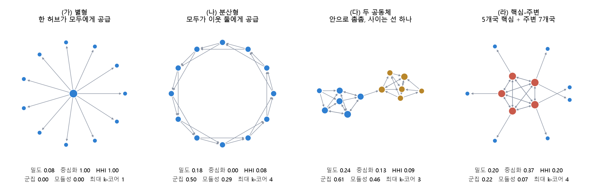
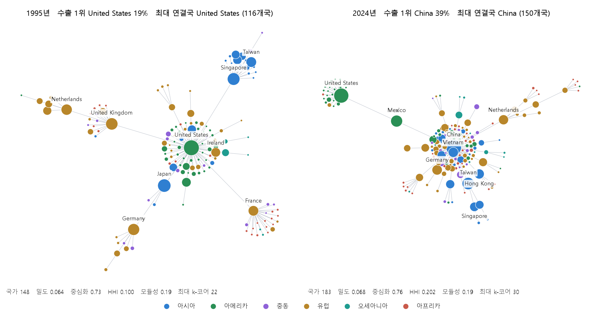

# 교역 네트워크를 읽는 지표

차수에서 공동체까지. 이 저장소의 대시보드와 보고서가 쓰는 네트워크 지표의 정의와 해석

작성일: 2026-09-14

## 요약

세계 교역은 나라를 점(노드), 나라 사이의 수출입 흐름을 선(엣지)으로 놓으면 하나의 네트워크가 된다. 선에는 방향(수출국에서 수입국으로)과 가중치(금액)가 있다. 이 문서는 그 네트워크를 요약하는 지표 열네 가지를 정의하고, 각 지표가 교역에서 무엇을 뜻하는지와 이 저장소에서 어떻게 계산했는지를 적는다. 지표는 네 범주로 나뉜다. 규모와 연결을 보는 활성 국가 수, 밀도, 호혜성, 중심성을 보는 차수 중심화, PageRank, HITS, 집중도를 보는 허핀달–허시먼 지수(HHI), 상위 5개국 점유율, 지니계수, 군집 구조를 보는 군집계수, 동류성, 모듈성, $`k`$-코어, 역내 비중이다.

## I. 교역 네트워크의 구성

한 개의 품목, 한 개의 연도마다 한 개의 그래프(graph)를 만든다. 다음 표는 그 그래프를 이루는 요소를 이 저장소에서 어떻게 정의했는지 정리한 것이다.

| 요소 | 이 저장소의 정의 |
|---|---|
| 노드(node) | 나라. 1995\~2024년 매년 수출과 수입이 모두 있는 207개국으로 고정 |
| 엣지(edge) | 수출국 $`i`$에서 수입국 $`j`$로 가는 흐름. 그해 그 품목의 흐름이 100만 달러 이상일 때만 |
| 가중치(weight) $`w_{ij}`$ | 흐름 금액(달러, BACI 원산지 기준) |
| 품목 단위 | HS92 4자리(호, heading). 대시보드는 12개 호, 보고서는 1,241개 호 전부 |

아래 수식에 쓰는 기호는 다음 표와 같다. 엣지의 유무를 나타내는 인접 행렬의 원소, 차수와 강도, 수출 점유율을 차례로 정의한다.

| 기호 | 뜻 |
|---|---|
| $`n`$, $`m`$ | 노드 수, 엣지 수 |
| $`a_{ij}`$ | $`i`$에서 $`j`$로 엣지가 있으면 1, 없으면 0 |
| $`k_i^{out} = \sum_j a_{ij}`$ | 나가는 차수(out-degree). $`i`$의 수출 상대국 수 |
| $`k_i^{in} = \sum_j a_{ji}`$ | 들어오는 차수(in-degree). $`i`$의 공급국 수 |
| $`s_i^{out} = \sum_j w_{ij}`$ | 나가는 강도(out-strength). $`i`$의 수출액 |
| $`p_i = s_i^{out} / \sum_k s_k^{out}`$ | $`i`$의 수출 점유율(export share) |

같은 자료로도 네트워크를 만드는 방식은 세 가지 점에서 달라질 수 있고, 지표는 그 선택에 민감하다.

- **가중치 임곗값(weight threshold).** 소액 흐름까지 넣으면 엣지 수가 두세 배로 늘고 밀도(density)가 크게 오른다. 일정 금액 아래의 엣지를 지우는 것을 임곗값 처리(thresholding)라 한다. 구조를 보려면 임곗값을 두는 편이 낫다. 이 저장소의 임곗값은 100만 달러다. 이 값은 명목 금액이라 물가가 오르면 같은 100만 달러가 가리키는 실질 금액이 줄고, 뒤의 해일수록 작은 흐름까지 네트워크에 포함된다. 미국 소비자물가지수(CPI-U)로 환산하면 2024년의 100만 달러는 1995년의 약 49만 달러다. 그래서 이 저장소는 1995년 불변가격 100만 달러를 해마다 CPI로 환산한 실질 임곗값으로도 같은 지표를 계산한다.
- **노드 고정(fixed node set).** 보고국 수가 해마다 늘어나면 네트워크 규모가 커진 결과 가운데 일부는 자료 범위가 넓어진 데서 비롯될 수 있다. 1995\~2024년 내내 교역이 관측되는 나라로 노드를 고정하면 이 효과를 통제할 수 있다.
- **방향과 가중치.** 같은 그래프를 방향 없는 그래프(undirected graph)나 가중치 없는 그래프(unweighted graph)로 다룰 수도 있다. 아래에서 지표마다 어느 그래프를 쓰는지 적었다.

대시보드의 그림은 이 그래프를 한 단계 더 줄여, 각 수입국을 그해 상위 1\~3개 공급국과만 연결한다. 모든 엣지를 그리면 그 수가 수천 개에 이르러 구조를 판독할 수 없기 때문이다. 지표는 줄이기 전의 전체 그래프에서 계산한다.

그림 1은 이 문서의 지표로 구분되는 네 가지 전형적 구조를 보인다. 노드가 12개인 작은 그래프를 만들고 아래의 정의에 따라 지표를 계산했다.



*그림 1. 네 가지 전형 구조. (가) 한 나라가 나머지 모두에게 수출하면 차수 중심화(degree centralization)와 HHI (Herfindahl–Hirschman index)가 1이다. (나) 모든 나라가 이웃 둘에게 수출하면 중심화는 0, HHI는 1/12이다. (다) 두 블록이 엣지 하나로 연결되면 모듈성(modularity)이 0.46으로 높다. (라) 서로 모두 거래하는 5개국 핵심(core)에 주변국(periphery)이 하나씩 연결되면 최대 $`k`$-코어($`k`$-core)가 4다. (나)의 모듈성이 0.29로 낮지 않은 이유는 V.3절에서 설명한다.*

## II. 규모와 연결

### 1. 활성 국가 수

활성 국가 수(active nodes)는 엣지가 하나 이상 연결된 노드의 수다. 해당 품목을 100만 달러 이상 거래한 나라의 수를 나타낸다. 보고서에서 HS4 호의 중위값은 1995년 50개국에서 2024년 81개국으로 늘었으며, 실질 임곗값으로 계산하면 2024년 중위값은 66개국이다.

### 2. 밀도

밀도는 실제 엣지 수를 가능한 엣지 수로 나눈 값이다. 방향 그래프(directed graph)에서 가능한 엣지는 $`n(n-1)`$개다.

```math
D = \frac{m}{n(n-1)}
```

밀도가 0에 가까우면 대부분의 나라 쌍이 그 품목을 거래하지 않는다는 뜻이다. 교역 네트워크의 밀도는 품목 단위에서 0.05 안팎으로 낮다. 활성 국가 수가 늘어도 새로 참여한 나라가 소수의 상대국과만 거래하면 밀도는 오히려 낮아진다.

### 3. 호혜성

호혜성(reciprocity)은 나라 쌍 가운데 한 방향으로라도 연결된 쌍의 수를 $`P`$, 그중 양방향으로 연결된 쌍의 수를 $`P^{\leftrightarrow}`$라 할 때 그 비율이다. 이 저장소는 igraph의 `reciprocity(mode="ratio")`로 계산한다.

```math
R = \frac{P^{\leftrightarrow}}{P}
```

호혜성은 같은 품목을 서로 수출하고 수입하는 산업 내 무역(intra-industry trade)이 많을수록 높다. 자동차·기계처럼 차별화된 제품에서 높고, 원유처럼 일부 나라만 생산하는 품목에서 낮다. 호혜성은 쌍이 아니라 링크(link) 단위로 정의하기도 한다. Garlaschelli and Loffredo (2004)의 정의 $`r = L^{\leftrightarrow}/L`$은 전체 링크 수 $`L`$ 가운데 반대 방향 링크가 함께 있는 링크 $`L^{\leftrightarrow}`$의 비율이다. 양방향 쌍 하나가 링크 둘로 세어지므로 두 값은 $`R = r/(2-r)`$의 관계에 있고, 늘 $`R \le r`$이다. 다른 연구의 호혜성 값과 비교할 때는 어느 정의를 썼는지 먼저 확인해야 한다.

## III. 중심성

### 1. 차수와 강도

한 나라의 나가는 차수 $`k_i^{out}`$는 수출 상대국 수, 들어오는 차수 $`k_i^{in}`$은 공급국 수다. 강도는 같은 연결을 금액으로 측정한 값으로, 나가는 강도 $`s_i^{out}`$가 수출액, 들어오는 강도 $`s_i^{in}`$이 수입액이다. 대시보드 상세 창의 수출 상대국 수와 공급국 수가 두 차수이고, 수출과 수입 금액이 두 강도다.

### 2. 차수 중심화

Freeman (1978)의 중심화 지수는 연결이 가장 많은 노드가 나머지 노드보다 얼마나 앞서 있는지를 0과 1 사이의 값으로 측정한다. 이 저장소는 나가는 차수를 기준으로 계산한다.

```math
C^{out} = \frac{\sum_{v} \left( k_{\max}^{out} - k_v^{out} \right)}{(n-1)^2}
```

분모 $`(n-1)^2`$은 분자가 가질 수 있는 최댓값으로, 한 나라가 나머지 모두에게 수출하고 나머지는 어느 나라에도 수출하지 않는 별 모양(그림 1의 가)일 때 나온다. 이 값이 커지면 그 품목의 공급 연결이 한 허브(hub)에 몰려 있음을 뜻한다. 대시보드의 "최대 연결국"이 그 허브다.

그림 2는 실제 자료로 그린 컴퓨터(HS 8471)의 네트워크다. 1995년의 허브는 116개국에 수출한 미국이었고, 2024년의 허브는 150개국에 수출한 중국이다. 허브가 바뀌는 동안 중심화는 0.73에서 0.76으로 소폭 올랐으나, 수출 HHI는 0.10에서 0.20으로 두 배가 되었다. 허브의 연결 범위보다 허브의 수출 점유율이 더 크게 변했음을 보여 준다.



*그림 2. 컴퓨터(HS 8471)의 네트워크, 1995년(왼쪽)과 2024년(오른쪽). 각 수입국을 그해 1위 공급국에만 연결했다. 어느 1위 공급 엣지에도 연결되지 않는 나라(1995년 2개국, 2024년 1개국)는 그리지 않았다. 원 크기는 수출과 수입의 합, 색은 지역이다. 아래 지표는 줄이기 전의 전체 그래프(고정 207개국, 100만 달러 이상 흐름)에서 계산한 값이다.*

### 3. PageRank

PageRank는 구글이 웹 페이지 순위에 쓴 지표로(Brin and Page, 1998), 중요한 노드로부터 큰 흐름을 받는 노드를 중요하다고 보는 재귀적 정의를 따른다. 엣지 방향을 따라 금액에 비례하는 확률로 이동하는 무작위 보행자(random walker)가 오래 머무는 노드일수록 값이 크다.

```math
PR(j) = \frac{1-d}{n} + d \sum_{i} PR(i) \, \frac{w_{ij}}{s_i^{out}}
```

$`d`$는 감쇠 계수(damping factor)이며 0.85를 쓴다. 이 저장소는 수출국에서 수입국으로 향하는 방향으로 계산하므로, PageRank가 높은 나라는 주요 공급국들의 수출이 모이는 수입 시장이다. 수입액이 같아도 주요 수출국들로부터 집중적으로 수입하는 나라의 값이 더 높다.

### 4. HITS: 허브와 권위

Kleinberg (1999)의 HITS는 두 점수를 함께 계산한다. 권위(authority) 점수가 높은 노드는 허브 점수가 높은 노드들이 가리키는 노드이고, 허브 점수가 높은 노드는 권위 점수가 높은 노드들을 가리키는 노드다. 교역에서 허브 점수는 큰 수입 시장들에 두루 공급하는 수출국을, 권위 점수는 큰 수출국들로부터 공급받는 수입국을 가리킨다. 이 저장소는 노드 표에 두 점수를 저장하지만 대시보드에는 PageRank만 쓴다. 두 정의가 서로를 참조하므로, 다음 두 식을 값이 수렴할 때까지 번갈아 적용해 계산한다.

```math
a_j \propto \sum_i w_{ij} \, h_i , \qquad h_i \propto \sum_j w_{ij} \, a_j
```

## IV. 집중도

### 1. 허핀달–허시먼 지수(HHI)

허핀달–허시먼 지수는 수출 점유율의 제곱합이다.

```math
H = \sum_i p_i^2, \qquad p_i = \frac{s_i^{out}}{\sum_k s_k^{out}}
```

여기서 $`p_i`$는 나라 $`i`$의 수출 점유율이다. 그 품목의 세계 수출액 가운데 $`i`$의 수출액 $`s_i^{out}`$이 차지하는 비율로, I장 표의 정의와 같다. 한 나라가 전부 수출하면 1이고, 열 나라가 똑같이 나누면 0.1이다. $`1/H`$는 같은 크기의 수출국 몇 개가 있는 것과 같은지를 나타내며, 유효 수출국 수(effective number of exporters)라 부른다. 대시보드 왼쪽의 곡선은 HHI의 연도별 추이를 보여 준다.

HHI는 여러 나라의 변화를 하나의 값으로 합치므로, 한 나라의 점유율이 크게 오르고 다른 여러 나라의 점유율이 조금씩 내리면 거의 변하지 않을 수 있다. 보고서에서 HS4 호의 HHI 중위값이 30년 동안 거의 일정했던 것이 그 경우다. 이때는 HHI의 변화를 국가별 기여 $`\Delta(p_i^2)`$로 분해해 본다.

### 2. 상위 5개국 점유율

상위 5개국 점유율(top-5 share)은 수출액 상위 다섯 나라의 점유율 합이다. HHI보다 해석이 단순하지만 1위와 5위의 차이는 반영하지 못한다. 1위의 점유율이 커지고 2\~5위의 점유율이 줄면 HHI는 오르는데 이 값은 그대로이거나 내릴 수 있다.

```math
T_5 = \sum_{i \in \text{top 5}} p_i
```

### 3. 지니계수

지니계수(Gini coefficient)는 수출액 분포의 불평등을 측정한다. $`x_i`$를 나라 $`i`$의 수출액, $`\bar{x}`$를 그 평균이라 하면 다음과 같다.

```math
G = \frac{\sum_i \sum_j \lvert x_i - x_j \rvert}{2 n^2 \bar{x}}
```

모든 나라의 수출액이 같으면 0이고, 한 나라가 전부 수출하면 1에 가깝다. HHI가 최상위 몇 나라에 가중치를 두는 데 비해 지니계수는 분포 전체를 반영한다. 교역에서는 소수의 큰 수출국과 다수의 작은 수출국이 공존하므로 지니계수가 0.8을 넘는 경우가 흔하다.

## V. 군집 구조

### 1. 군집계수

군집계수(clustering coefficient)는 한 노드의 이웃들이 서로 연결되어 있는 정도다. 방향과 가중치를 무시한 그래프에서 노드 $`v`$의 이웃이 $`k_v`$개이고 그 이웃끼리 연결된 쌍이 $`T_v`$개일 때 다음과 같다.

```math
C_v = \frac{T_v}{k_v (k_v - 1) / 2}, \qquad \bar{C} = \frac{1}{n} \sum_v C_v
```

이웃이 둘 미만인 노드는 $`C_v = 0`$으로 둔다. 값이 높으면 교역 관계가 삼각형을 이룬다. A가 B, C와 거래할 때 B와 C도 서로 거래하는 경우가 많다는 뜻이다.

### 2. 동류성

동류성(assortativity)은 엣지 양 끝에 있는 두 노드의 차수가 서로 얼마나 비슷한지를 측정하는 피어슨 상관계수(Pearson correlation coefficient)다(Newman, 2002). 방향 없는 그래프에서 엣지 $`e`$ 양 끝의 차수를 $`j_e`$, $`k_e`$, 엣지 수를 $`M`$이라 하면 다음과 같다.

```math
r = \frac{\frac{1}{M}\sum_e j_e k_e - \left[ \frac{1}{2M}\sum_e (j_e + k_e) \right]^2}{\frac{1}{2M}\sum_e (j_e^2 + k_e^2) - \left[ \frac{1}{2M}\sum_e (j_e + k_e) \right]^2}
```

$`r`$이 양수면 연결이 많은 나라는 연결이 많은 나라와, 연결이 적은 나라는 연결이 적은 나라와 이어진다(동류, assortative). 음수면 연결이 많은 나라가 연결이 적은 나라들과 이어진다(이류, disassortative). 교역 네트워크는 대표적인 이류 네트워크로 알려져 있다(Serrano and Boguñá, 2003). 큰 수출국이 작은 나라들에 두루 공급하고, 작은 나라들 사이의 교역은 적기 때문이다. 보고서에서 HS4 호의 중위값은 1995년과 2024년 모두 −0.41로 30년 동안 거의 변하지 않았고, 컴퓨터(HS 8471)는 −0.55에서 −0.49로 소폭 올랐다.

### 3. 공동체(community)와 모듈성

공동체 탐지(community detection)는 내부 연결은 조밀하고 외부 연결은 성긴 노드 집합을 찾는다. 이 저장소는 Leiden 알고리즘(Traag et al., 2019)을 방향 없는 가중 그래프에 적용한다. 이 그래프의 가중치 $`w_{ij}`$는 양방향 금액의 합, $`s_i`$는 그 강도, $`W`$는 전체 가중치다. 모듈성 $`Q`$는 찾아낸 공동체 $`c`$ 안의 연결이 무작위 연결을 가정한 기준(널 모형, null model)에서 기대되는 것보다 얼마나 많은지를 측정한다.

```math
Q = \frac{1}{2W} \sum_{i,j} \left[ w_{ij} - \frac{s_i s_j}{2W} \right] \delta(c_i, c_j)
```

$`\delta(c_i, c_j)`$는 두 나라가 같은 공동체에 속하면 1, 아니면 0이다. Newman and Girvan (2004)은 뚜렷한 공동체 구조가 있는 실제 네트워크에서 $`Q`$가 대개 0.3\~0.7 사이에 있다고 보고했다. 교역에서는 유럽, 북미, 동아시아 같은 지역 블록(regional bloc)이 공동체로 나타나는 경우가 많다.

다만 $`Q`$ 값만으로 블록의 존재를 판단할 수는 없다. 그림 1의 (나)는 모든 나라가 이웃 둘에게만 수출하는 규칙적인 고리 구조인데도 $`Q`$가 0.29로 나온다. 모듈성은 무작위 그래프(random graph)와 비교하는 지표이므로, 가까운 나라끼리만 거래하는 구조에서는 뚜렷한 블록이 없어도 양수가 나온다. 모듈성이 높게 나오면 찾아낸 공동체가 실제로 무엇에 대응하는지(지역인지, 소득 수준인지)를 함께 확인한다.

### 4. $`k`$-코어

$`k`$-코어는 모든 노드의 차수가 $`k`$ 이상인 가장 큰 부분 그래프(subgraph)다(Seidman, 1983). 이웃이 $`k`$개 미만인 노드를 지우는 과정을 더 지울 노드가 없을 때까지 반복하면 남는다. 최대 $`k`$-코어는 서로 조밀하게 연결된 핵심부의 규모를 나타내며, 주변부가 넓어지는 것과 별개로 핵심부가 커지는지를 확인할 수 있게 한다. 그림 2의 컴퓨터는 30년 동안 최대 $`k`$-코어가 22에서 30으로 커졌다.

### 5. 역내 비중

역내 비중(intra-regional share)은 같은 지역 안에서 오간 흐름의 금액 비중이다. 네트워크 이론의 표준 지표는 아니지만, 공동체가 지리적 지역과 일치하는지를 가장 단순하게 확인하는 지표다. 이 저장소의 지역은 아시아, 아메리카, 중동, 유럽, 오세아니아, 아프리카의 여섯이다. $`g(i)`$를 나라 $`i`$의 지역이라 하면 다음과 같다.

```math
I = \frac{\sum_{i,j \,:\, g(i) = g(j)} w_{ij}}{\sum_{i,j} w_{ij}}
```

## VI. 지표의 해석

지표 하나만으로는 결론을 내리기 어렵다. 보고서의 분석에서 확인한 점 세 가지를 적는다.

1. **한 노드의 변화가 전체 지표를 좌우할 수 있다.** 차수 중심화와 지니계수가 30년 동안 크게 오른 것은 품목마다 한 나라(중국)가 허브가 되었기 때문이다. 그 노드를 제외하고 다시 계산하면 중심화의 상승은 사라지고 수출 집중도는 오히려 낮아진다. 중심성(centrality)과 집중도(concentration) 지표가 크게 변하면 먼저 어느 나라의 변화인지를 확인한다.
2. **집계 수준(level of aggregation)에 따라 결론이 달라진다.** 품목 단위(HS4)에서는 밀도가 낮아졌지만, 모든 품목을 합친 전체 교역에서는 밀도가 높아졌다. 나라 쌍이 거래하는 품목의 수가 늘어도 품목별 네트워크는 오히려 성길 수 있다.
3. **자료 범위를 먼저 고정한다.** 보고국 수가 해마다 달라지면 활성 국가 수와 밀도가 함께 변동한다. 노드를 고정한 결과와 고정하지 않은 결과를 함께 제시한다. 명목 임곗값에도 같은 문제가 있으므로 실질 임곗값으로 계산한 결과를 함께 제시한다.

## VII. 이 저장소의 계산 방법

다음 표는 지표마다 계산에 쓴 그래프의 형태와 계산 코드를 정리한 것이다. 그래프 열의 "방향"과 "방향 없음"은 엣지 방향을 쓰는지를, "가중"과 "무가중"은 금액을 쓰는지를 뜻한다.

| 지표 | 그래프 | 코드 |
|---|---|---|
| 활성 국가 수, 밀도, 호혜성 | 방향, 무가중 | `scripts/04_compute_metrics.py` |
| HHI, 상위 5개국 점유율, 지니계수 | 수출 강도 | 같음 |
| 차수 중심화 | 방향, 나가는 차수 | 같음 |
| PageRank, HITS | 방향, 가중 | 같음 (igraph) |
| 군집계수, 동류성, $`k`$-코어 | 방향 없음, 무가중 | 같음 |
| 공동체, 모듈성 | 방향 없음, 가중 | 같음 (leidenalg, 해상도 1) |
| 역내 비중 | 방향, 가중 | 같음 |
| 대시보드의 노드·엣지 | 방향, 가중, 상위 3개 공급국 | `scripts/10_export_network_json.py` |
| 이 문서의 그림 1·2와 인용 수치 | 위와 같은 정의 | 이 폴더의 `분석_파이썬_코드.ipynb` |

## 참고문헌

DOI는 Crossref 기록과 대조했다(2026-09-14).

- Brin, S. and Page, L. (1998). The anatomy of a large-scale hypertextual Web search engine. *Computer Networks and ISDN Systems* 30(1–7), 107–117. https://doi.org/10.1016/S0169-7552(98)00110-X
- De Benedictis, L. and Tajoli, L. (2011). The world trade network. *The World Economy* 34(8), 1417–1454. https://doi.org/10.1111/j.1467-9701.2011.01360.x
- Fagiolo, G., Reyes, J. and Schiavo, S. (2009). World-trade web: Topological properties, dynamics, and evolution. *Physical Review E* 79(3), 036115. https://doi.org/10.1103/PhysRevE.79.036115
- Freeman, L. C. (1978). Centrality in social networks conceptual clarification. *Social Networks* 1(3), 215–239. https://doi.org/10.1016/0378-8733(78)90021-7
- Garlaschelli, D. and Loffredo, M. I. (2004). Patterns of link reciprocity in directed networks. *Physical Review Letters* 93(26), 268701. https://doi.org/10.1103/PhysRevLett.93.268701
- Gaulier, G. and Zignago, S. (2010). BACI: International trade database at the product-level. The 1994–2007 version. CEPII Working Paper 2010-23.
- Kleinberg, J. M. (1999). Authoritative sources in a hyperlinked environment. *Journal of the ACM* 46(5), 604–632. https://doi.org/10.1145/324133.324140
- Newman, M. E. J. (2002). Assortative mixing in networks. *Physical Review Letters* 89(20), 208701. https://doi.org/10.1103/PhysRevLett.89.208701
- Newman, M. E. J. (2018). *Networks*, 2nd ed. Oxford University Press. https://doi.org/10.1093/oso/9780198805090.001.0001
- Newman, M. E. J. and Girvan, M. (2004). Finding and evaluating community structure in networks. *Physical Review E* 69(2), 026113. https://doi.org/10.1103/PhysRevE.69.026113
- Seidman, S. B. (1983). Network structure and minimum degree. *Social Networks* 5(3), 269–287. https://doi.org/10.1016/0378-8733(83)90028-X
- Serrano, M. Á. and Boguñá, M. (2003). Topology of the world trade web. *Physical Review E* 68(1), 015101(R). https://doi.org/10.1103/PhysRevE.68.015101
- Traag, V. A., Waltman, L. and van Eck, N. J. (2019). From Louvain to Leiden: Guaranteeing well-connected communities. *Scientific Reports* 9, 5233. https://doi.org/10.1038/s41598-019-41695-z
- U.S. Bureau of Labor Statistics. Consumer Price Index for All Urban Consumers: All Items in U.S. City Average (CPIAUCNS), annual average. Retrieved from FRED, Federal Reserve Bank of St. Louis, 2026-09-14. https://fred.stlouisfed.org/series/CPIAUCNS
