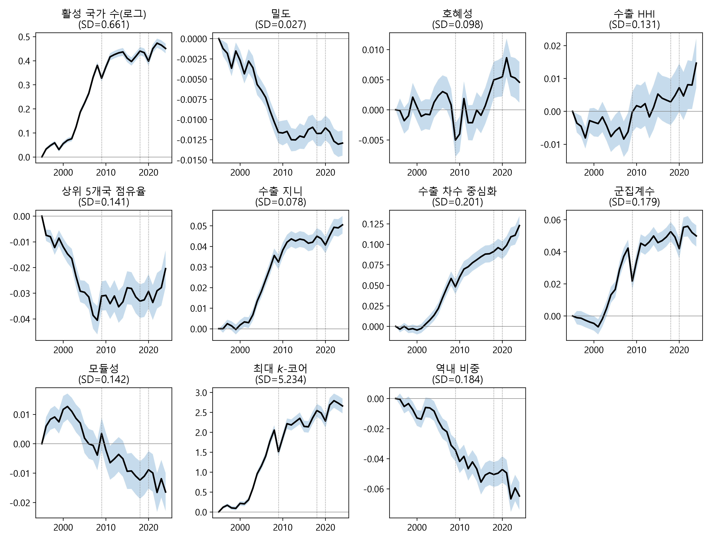
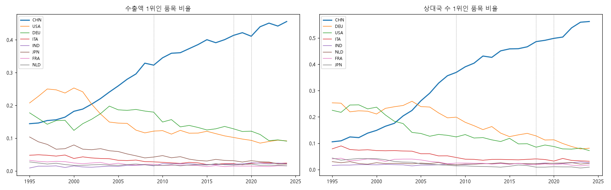
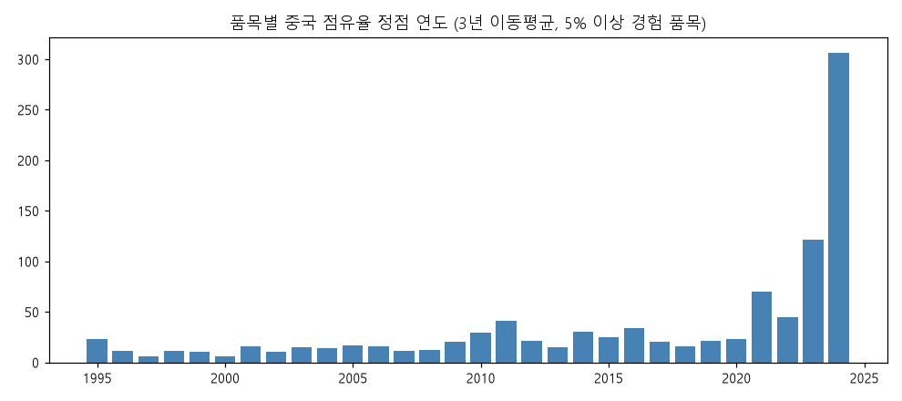
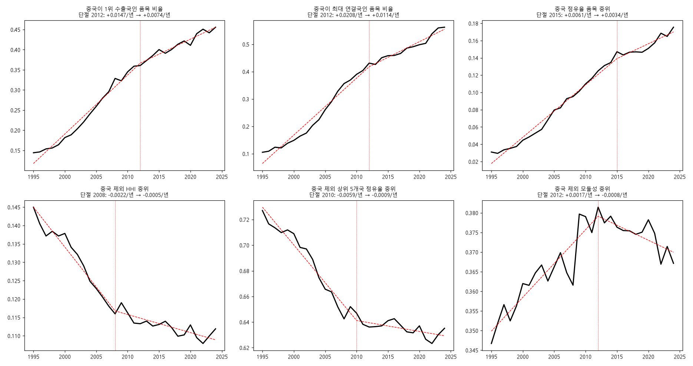

# 중국 허브화와 세계 교역 네트워크, 1995–2024

BACI 품목별 네트워크 지표로 본 장기 특징과 전환의 시점

작성일: 2026-09-14
자료: BACI HS92 V202601 (CEPII, 2026-01-30 공개; Gaulier and Zignago 2010). 라이선스 Etalab 2.0.
재현: 이 폴더의 `분석_파이썬_코드.ipynb`. 입력 DB는 저장소의 `scripts/01`~`04`가 만든다. 그림은 이 문서 옆 `img/` 폴더에 있다. 지표 정의는 부록 A, 자세한 설명은 해설 문서 [「교역 네트워크를 읽는 지표」](../네트워크_이론/교역네트워크_지표.md).

## 요약

1995년부터 2024년까지 품목별 세계 교역 네트워크의 전체 지표는 "허브화"를 가리킨다. 수출 차수 중심화와 수출 지니계수가 올랐고 역내 교역 비중은 내렸다. 그러나 이 변화는 중국 한 노드가 거의 모든 품목의 허브가 된 결과다. 2024년 중국은 HS4 1,241개 호의 45.6%에서 수출액 1위, 56.2%에서 수출 상대국 수 1위다(1995년 14.4%, 10.5%). 중국을 노드에서 제거하면 허브화와 탈지역화 추세는 사라지고, 수출 집중도(HHI)와 상위 5개국 점유율은 뚜렷이 내리며 모듈성은 오른다. 중국을 제외한 세계는 30년간 탈집중·블록화했다.

이 추세에 변화가 생기는 시점은 셋으로 갈린다. 중국 허브화의 속도는 2012년을 단절점으로 절반으로 줄었고, 2015~2019년에는 품목 중위 점유율이 멈췄다가 2020년 이후 다시 올랐다. 품목 단위로는 중국 점유율이 정점을 지난 호가 41%(415개)인데, 농식품·광물·목재는 2007~2014년에, 신발·가죽·섬유는 2012~2017년에 정점을 지났고, 기계·전기·화학·플라스틱은 아직 상승 중이다. 한편 중국을 제외한 세계의 탈집중은 2008~2012년에 멈췄고, 모듈성은 2012년 이후 되돌아오고 있다.

## 1. 자료와 방법

- **자료.** BACI HS92 판, 1995–2024, 수출국·수입국·HS6·연도당 한 행, 2억 6,989만 행. BACI는 UN Comtrade의 수출국·수입국 보고를 조정해 한 값으로 만든 자료이며 원산지 기준(country of origin)이다. 2024년은 잠정치다.
- **네트워크.** HS4 호(1,241개)마다 연도별로 국가를 노드(node), 수출국→수입국 흐름을 엣지(edge, 가중치는 달러 금액)로 하는 방향 그래프(directed graph). 노드는 30년 내내 수출·수입이 모두 있는 207개국으로 고정하고(고정 국가군, balanced panel of countries), 100만 달러 미만 흐름은 가중치 임곗값(weight threshold)으로 제외했다(변형 `w1m_bal`).
- **중국 제외.** 같은 조건에서 중국 노드와 그에 닿는 엣지를 모두 제거한 변형(`w1m_bal_xchn`)을 따로 계산했다. 점유율은 남은 국가들 사이에서 다시 정규화(renormalization)된다.
- **지표.** 활성 국가 수(active nodes), 밀도(density), 호혜성(reciprocity), 수출 HHI(Herfindahl–Hirschman index), 상위 5개국 점유율(top-5 share), 수출 지니계수(Gini coefficient), 수출 차수 중심화(export degree centralization), 군집계수(clustering coefficient), 모듈성(modularity, Leiden 알고리즘), 최대 k-코어(k-core), 역내 비중(intra-regional trade share). 정의는 부록 A.
- **검정.** 품목 고정효과(product fixed effects) 패널(1,203호 × 30년 = 36,090행, 품목 군집 표준오차 clustered by product)로 선형추세(linear trend)를 추정했다. 전환 시점은 연도별 품목 중위 시계열에 단일 기울기 단절점(single slope break; 연속 구간선형 continuous piecewise linear, 오차제곱합 최소)을 맞추고, 품목별로는 중국 점유율 3년 이동평균(3-year moving average)의 정점 연도(peak year)를 구했다. 노드 고정을 풀거나(`w1m`) 임곗값을 없애도(`raw`) 핵심 결과(수출 차수 중심화·지니·k-코어의 상승, 역내 비중의 하락)의 방향은 같다. 밀도와 상위 5개국 점유율은 사양에 따라 부호가 달라진다(부록 B).

## 2. 전체 지표의 30년

HS4 호의 중위값, 그리고 패널 추세(10년당, 표준편차 단위).

| 지표 | 1995 | 2024 | 추세 β/10년 (SD) |
|---|---|---|---|
| 활성 국가 수 | 50 | 81 | +0.27*** |
| 밀도 | 0.063 | 0.050 | −0.17*** |
| 호혜성 | 0.156 | 0.154 | +0.02*** |
| 수출 HHI | 0.142 | 0.145 | +0.04*** |
| 상위 5개국 점유율 | 0.717 | 0.697 | −0.06*** |
| 수출 지니 | 0.826 | 0.878 | +0.26*** |
| 수출 차수 중심화 | 0.433 | 0.583 | +0.24*** |
| 군집계수 | 0.398 | 0.463 | +0.13*** |
| 모듈성 | 0.348 | 0.325 | −0.06*** |
| 최대 k-코어 | 6 | 8 | +0.21*** |
| 역내 비중 | 0.614 | 0.538 | −0.13*** |

가장 큰 변화는 수출 차수 중심화와 수출 지니의 상승이다. 품목마다 한 수출국이 거의 모든 수입국과 연결되고, 수출액 분포의 꼭대기가 두꺼워졌다. 역내 비중은 내렸다. 지역 안의 교역이 아니라 지역을 가로지르는 교역이 늘었다. 활성 국가 수는 늘었으나 밀도는 내렸다. 새로 참여한 나라들은 소수의 상대국과만 거래한다.

수출 HHI의 추세가 작은 것이 눈에 띈다. 지니와 중심화가 크게 오르는데 HHI는 거의 평평하다. 이유는 §3에서 드러난다.

이 변화의 대부분은 2002~2010년에 일어났다. 연도 고정효과(year fixed effects) 곡선에서 지니·중심화·k-코어·활성 국가 수는 2002년부터 가파르게 오르다 2009년에 한 해 꺾이고(30년 중 가장 큰 연간 변화), 2010년 이후 완만한 고원을 이룬다. 2018년의 미중 관세는 이 지표들에 흔적을 남기지 않았다. 2020년은 짧은 수축 뒤 회복이며, 회복이 신고점을 만드는지는 중국의 포함 여부에 달렸다(§5).

*그림 1. 지표별 연도 고정효과(1995=0)와 95% 신뢰구간. HS4 1,203개 호, 고정 207개국, 품목 군집 표준오차.*

## 3. 허브의 정체

품목마다 수출액 1위인 국가와 수출 상대국 수 1위인 국가를 세었다.

| 연도 | 수출액 1위 품목 비율: 중국 | 미국 | 독일 | 일본 | 상대국 수 1위 품목 비율: 중국 | 독일 | 미국 |
|---|---|---|---|---|---|---|---|
| 1995 | 14.4% | 20.7% | 17.7% | 10.4% | 10.5% | 25.3% | 22.5% |
| 2005 | 25.9% | 14.6% | 18.6% | 5.9% | 26.1% | 23.9% | 13.7% |
| 2015 | 40.0% | 12.1% | 12.5% | 3.0% | 45.8% | 12.5% | 11.8% |
| 2024 | 45.6% | 9.2% | 9.1% | 2.1% | 56.2% | 8.1% | 7.2% |

차수 중심화를 끌어올리는 노드는 중국이다. 1995년에는 독일과 미국이 각각 4분의 1의 품목에서 최대 연결국(수출 상대국 수가 가장 많은 나라, most-connected exporter)이었으나 2024년에는 중국이 절반을 넘는다. 중국 점유율의 품목 중위는 1.8%에서 15.8%로 올랐다.

*그림 2. 품목별 수출액 1위(왼쪽)와 수출 상대국 수 1위(오른쪽)인 품목의 비율. 점선은 2009·2018·2020년.*

수출 HHI가 평평했던 이유는 국가별 분해에서 드러난다. 품목 평균 HHI 변화(1995~97 → 2022~24)는 +0.0007에 불과한데, 중국의 기여는 +0.056이고 미국(−0.019)·독일(−0.012)·일본(−0.008)·이탈리아·캐나다·영국의 기여는 합쳐 −0.052다. 중국이 오른 만큼 옛 선진 수출국이 내렸다. 지니와 중심화는 최상위 한 노드의 몫을 HHI보다 민감하게 잡기 때문에 크게 올랐다.

*그림 3. 수출 HHI의 품목 중위·평균, 실제(검정)와 중국을 뺀 뒤 재정규화한 값(빨강).*

## 4. 중국을 제외한 세계

같은 지표를 중국 노드 없이 다시 계산한 결과다. 패널 추세(10년당, SD 단위).

| 지표 | 중국 포함 | 중국 제외 | 판정 |
|---|---|---|---|
| 수출 차수 중심화 | +0.24*** | 0.00 (n.s.) | 사라짐 |
| 역내 비중 | −0.13*** | −0.01 (n.s.) | 사라짐 |
| 수출 HHI | +0.04*** | −0.11*** | 반전 |
| 모듈성 | −0.06*** | +0.06*** | 반전 |
| 상위 5개국 점유율 | −0.06*** | −0.18*** | 하락 강화 |
| 수출 지니 | +0.26*** | +0.10*** | 4할로 축소 |
| 군집계수 | +0.13*** | +0.06*** | 절반 |
| 최대 k-코어 | +0.21*** | +0.19*** | 유지 |
| 활성 국가 수(로그) | +0.27*** | +0.21*** | 유지 |
| 밀도 | −0.17*** | −0.11*** | 유지 |

HS2 수준(96류)에서도 같다. 중심화 +0.38 → +0.11, 지니는 유의하지 않게, HHI와 모듈성은 부호가 바뀐다.

중국을 빼면 30년간의 허브화(hub formation)와 탈지역화는 없다. 중국 제외 역내 비중은 2007년까지 오히려 올랐다가 그 뒤 내려와 1995년 수준이고, 중국 제외 차수 중심화는 1995~2001년에 떨어졌다가 2008년까지 원위치로 돌아온 뒤 평평하다. 대신 수출 HHI와 상위 5개국 점유율이 뚜렷이 내렸고 모듈성이 올랐다. 중국 제외 세계는 더 여러 수출국으로 나뉘고 블록 구조가 또렷해지는 방향으로 움직였다.

*그림 4. 그림 1과 같은 연도 고정효과를 중국 노드를 뺀 네트워크에서 다시 계산한 것.*

중국을 빼도 남는 변화는 핵심부(core) 심화(k-코어), 주변부(periphery) 확장(활성 국가 수), 작은 품목의 밀도 하락, 그리고 지니의 일부다. 남은 지니 상승은 2003~2009년에 집중돼 있어, 중국 부상기에 중간 수출국들이 밀려나며 벌어진 격차로 읽을 수 있다.

따라서 §2의 문장은 이렇게 고쳐야 한다. 세계 교역 네트워크가 허브화한 것이 아니라, **중국 한 노드가 거의 모든 품목의 허브가 되면서 전체 지표가 그렇게 보였고, 중국을 제외한 세계는 탈집중(deconcentration)·블록화(bloc formation)했다.**

## 5. 언제부터 변화가 생기는가

### 5.1 중국 허브화의 감속: 2012년, 그리고 2015~2019년의 정체

연도별 시계열에 단일 기울기 단절점을 맞춘 결과.

| 계열 | 단절 연도 | 이전 기울기(연) | 이후 기울기(연) |
|---|---|---|---|
| 중국이 1위 수출국인 품목 비율 | 2012 | +1.47%p | +0.74%p |
| 중국이 최대 연결국인 품목 비율 | 2012 | +2.08%p | +1.14%p |
| 중국 점유율 품목 중위 | 2015 | +0.61%p | +0.34%p |
| 중국 점유율 품목 평균 | 2011 | +0.65%p | +0.24%p |

5년 구간별 변화와 1위 지위의 회전.

| 구간 | 1위 품목 비율 변화 | 중국 점유율 중위 변화 | 1위 획득 | 1위 상실 | 순증 |
|---|---|---|---|---|---|
| 1995→2000 | +3.8%p | +1.4%p | 103 | 56 | +47 |
| 2000→2005 | +7.7%p | +3.5%p | 160 | 65 | +95 |
| 2005→2010 | +8.6%p | +3.0%p | 188 | 87 | +101 |
| 2010→2015 | +5.5%p | +3.7%p | 160 | 91 | +69 |
| 2015→2019 | +2.1%p | −0.1%p | 116 | 94 | +22 |
| 2019→2024 | +3.4%p | +2.9%p | 186 | 146 | +40 |

중국 허브화의 속도는 2012년 전후로 절반이 됐다. 2015~2019년에는 품목 중위 점유율이 멈췄고 1위 순증도 22개로 가장 적었다. 2020년 이후 점유율은 다시 올랐으나 1위 상실도 146개로 30년 중 가장 많다. 중국이 새로 1위가 되는 품목만큼 1위를 잃는 품목도 늘어난 것이다. 2019년 1위였다가 2024년 1위가 아닌 37개 호는 이탈리아·독일·베트남·미국·인도·모로코·브라질·방글라데시로 갔다.

### 5.2 품목 수준의 정점 통과: 1차산품에서 시작해 노동집약 소비재로

중국 점유율이 한 번이라도 5%를 넘은 1,015개 호에서, 점유율(3년 이동평균)의 정점 연도를 구했다. 2024년 값이 정점의 90% 아래이고 정점이 2021년 이전인 호를 "정점 통과(past peak)"로 본다.

- 정점 통과 415개(41%). 정점이 2022년 이후라 아직 상승 중인 호 472개(47%).
- 정점 연도의 분포는 2010~2016년에 한 무리(연 20~34개), 2021~2024년에 큰 무리(2023년 121개, 2024년 306개)다.

*그림 6. 품목별 중국 점유율(3년 이동평균)의 정점 연도 분포. 점유율이 한 번이라도 5%를 넘은 1,015개 호.*

| 부 | 품목 수 | 정점 연도 중위 | 정점 통과 | 아직 상승 중 | 2024 중국 점유율 중위 |
|---|---|---|---|---|---|
| 동물성 생산품 | 25 | 2007 | 92% | 4% | 6.4% |
| 광물성 생산품 | 38 | 2008 | 76% | 16% | 6.1% |
| 식품·음료·담배 | 28 | 2007 | 75% | 25% | 9.3% |
| 목재·코르크 | 20 | 2014 | 75% | 5% | 11.3% |
| 신발·모자 | 20 | 2012 | 65% | 15% | 52.1% |
| 가죽·모피 | 19 | 2016 | 63% | 32% | 14.7% |
| 식물성 생산품 | 47 | 2011 | 62% | 30% | 8.2% |
| 섬유 | 141 | 2017 | 50% | 36% | 35.6% |
| 정밀·의료·시계·악기 | 53 | 2021 | 36% | 42% | 23.6% |
| 화학공업 생산품 | 147 | 2022 | 35% | 55% | 17.1% |
| 비금속 | 142 | 2022 | 32% | 54% | 19.0% |
| 잡품 | 32 | 2021 | 25% | 44% | 50.7% |
| 기계·전기기기 | 129 | 2023 | 18% | 69% | 24.3% |
| 플라스틱·고무 | 39 | 2024 | 18% | 74% | 18.2% |
| 펄프·종이 | 28 | 2024 | 18% | 75% | 17.5% |

변화는 순서가 있다. 동물성·광물성·식품은 2007~2008년에, 식물성·신발은 2011~2012년에, 목재·가죽·섬유는 2014~2017년에 정점을 지났다. 1차산품과 노동집약 소비재에서 중국의 몫은 이미 10년 전에 꺾였고, 신발(52%)과 섬유(36%)는 여전히 높은 점유율에서 내려오는 중이다. 반면 기계·전기, 플라스틱, 펄프·종이, 화학, 비금속은 정점이 2022년 이후로 아직 오르고 있다. 2020년 이후의 재상승(§5.1)은 이 자본·기술집약 품목군이 끌고 있다.

### 5.3 중국 제외 세계의 탈집중은 2008~2012년에 멈췄다

| 계열 | 단절 연도 | 이전 기울기(연) | 이후 기울기(연) |
|---|---|---|---|
| 중국 제외 HHI 중위 | 2008 | −0.0022 | −0.0005 |
| 중국 제외 상위 5개국 점유율 중위 | 2010 | −0.0059 | −0.0009 |
| 중국 제외 모듈성 중위 | 2012 | +0.0017 | −0.0008 |

중국 제외 세계의 탈집중은 1995~2010년의 현상이다. HHI는 0.145에서 0.116으로 내린 뒤 2010년대에 0.11 근처에서 멈췄고, 상위 5개국 점유율도 0.73에서 0.64로 내린 뒤 평평하다. 모듈성은 2012년까지 오르다 그 뒤 되돌아온다. 즉 §4의 "탈집중·블록화"는 30년 평균의 서술이며, 그 대부분은 중국 부상기와 같은 시기에 일어났고 2010년대 이후에는 진행이 멈췄다.

*그림 5. 중국 허브화 세 계열(위)과 중국 제외 세계 세 계열(아래)의 연도별 값과 단일 기울기 단절점(빨간 점선).*

### 5.4 시간표

| 시기 | 중국 | 중국 제외 세계 |
|---|---|---|
| 1995–2001 | 완만한 확장 | 탈집중 시작, 중심화 하락 |
| 2002–2010 | 가장 빠른 허브화. 1위 순증 연 20개 | 탈집중 가속, 모듈성 상승. 지니는 상승(중간국 밀림) |
| 2009 | 한 해 수축 | 한 해 수축, 모듈성 점프 |
| 2011–2015 | 감속(2012 단절). 1차산품·신발에서 정점 통과 | 탈집중 정지(2008~2010 단절), 모듈성 정점(2012) |
| 2015–2019 | 정체. 점유율 중위 변화 없음. 섬유·가죽 정점 통과 | 정체 |
| 2020–2024 | 재상승, 그러나 1위 상실도 최다. 기계·화학·플라스틱이 견인 | 회복(2010년대 수준), 모듈성 하락 |

## 6. 한계

- BACI는 원산지 기준 조정치다. 중계국(홍콩·네덜란드)의 재수출이 원산국에 얹히므로 통관 통계와 다르다. 이 보고서의 "중국 점유율"은 원산지 기준이다.
- 2024년은 잠정치다. §5의 "아직 상승 중" 판정과 2020년 이후 재상승은 다음 판(2027년 1월)에서 다시 봐야 한다.
- 단절점은 단일 기울기 변화를 가정한 기술적 추정이며, 검정 통계량을 붙이지 않았다. 2015~2019년 정체와 2020년 이후 재상승은 5년 구간 표에서 직접 확인된다.
- 사건 검정에 통제군이 없다. 2009년의 수축은 시점의 일치이지 원인 특정이 아니다.
- 품목을 동일 가중했다. 총액 가중에서는 밀도의 부호가 바뀌고(작은 품목의 밀도는 내리고 큰 품목은 오른다) 상위 5개국 점유율은 유의하지 않다(부록 B).

## 부록 A. 지표 정의

노드 = 국가, 엣지 = 수출국→수입국, 가중치 = 흐름 금액.

| 지표 | 정의 |
|---|---|
| 활성 국가 수 | 엣지가 하나라도 있는 노드 수 |
| 밀도 | 엣지 수 / (n·(n−1)) |
| 호혜성 | 양방향 흐름이 있는 쌍 / 연결된 쌍. 링크 기준 정의(Garlaschelli and Loffredo 2004)와의 관계는 해설 문서 §2 |
| 수출 HHI | 수출국 점유율 제곱합 |
| 상위 5개국 점유율 | 수출액 상위 5개국의 합 / 총액 |
| 수출 지니 | 수출액 분포의 지니 |
| 수출 차수 중심화 | 프리먼 차수 중심화(Freeman 1978), 수출 상대국 수 기준, 가중 없음 |
| 군집계수 | 무방향 그래프의 평균 국지 군집계수 |
| 모듈성 | Leiden 알고리즘(Traag 외 2019; 무방향 가중, 해상도 1)으로 찾은 공동체의 모듈성 |
| 최대 k-코어 | 무방향 그래프의 최대 코어 수(Seidman 1983) |
| 역내 비중 | 같은 대륙 안 흐름 금액 / 총액 (Asia, Europe, Africa, America, Middle East, Oceania) |

## 부록 B. 견고성과 재현

주 사양(HS4, 고정 207개국, 100만 달러 이상 흐름)의 10년당 추세(β/SD)를 네 사양과 견준 결과다. 이 폴더의 `분석_파이썬_코드.ipynb` §2가 모두 계산한다.

| 지표 | 주 사양 | 노드 고정 없음(`w1m`) | 임곗값 없음(`raw`) | HS2 | 총액 가중 |
|---|---|---|---|---|---|
| 활성 국가 수(로그) | +0.27*** | +0.27*** | +0.25*** | +0.27*** | +0.18*** |
| 밀도 | −0.17*** | −0.19*** | +0.27*** | +0.20*** | +0.07* |
| 호혜성 | +0.02*** | +0.00 | +0.23*** | +0.12*** | +0.09*** |
| 수출 HHI | +0.04*** | +0.05*** | +0.10*** | +0.04 | +0.05* |
| 상위 5개국 점유율 | −0.06*** | −0.05*** | +0.02** | −0.03 | −0.01 |
| 수출 지니 | +0.26*** | +0.27*** | +0.10*** | +0.13*** | +0.12*** |
| 수출 차수 중심화 | +0.24*** | +0.22*** | +0.29*** | +0.38*** | +0.25*** |
| 군집계수 | +0.13*** | +0.12*** | +0.17*** | +0.21*** | +0.16*** |
| 모듈성 | −0.06*** | −0.05*** | −0.02*** | −0.06** | −0.11*** |
| 최대 k-코어 | +0.21*** | +0.20*** | +0.30*** | +0.29*** | +0.48*** |
| 역내 비중 | −0.13*** | −0.14*** | −0.13*** | −0.18*** | −0.12*** |

유의수준: * 10%, ** 5%, *** 1%. 품목 군집 표준오차.

- 이 보고서의 핵심 결과인 수출 차수 중심화·수출 지니·군집계수·최대 k-코어의 상승과 역내 비중·모듈성의 하락은 다섯 사양 모두에서 같은 부호로 유의하다.
- 밀도는 사양에 따라 부호가 바뀐다. HS4·동일 가중·임곗값 있음일 때만 내리므로, "작은 품목에서 연결이 국가 수만큼 늘지 않았다"로만 읽는다.
- 상위 5개국 점유율은 임곗값을 없애면 부호가 바뀌고, HS2와 총액 가중에서는 유의하지 않다. 수출 HHI도 HS2에서는 유의하지 않다. §3이 보인 대로 이 두 지표는 중국의 상승과 옛 선진 수출국의 하락이 서로 상쇄되는 자리여서 사양에 민감하다.
- 호혜성은 노드 고정을 풀면 유의하지 않고, 임곗값을 없애면 +0.23으로 크게 오른다.
- 입력 DB는 저장소의 `scripts/01`~`04`가 만든다. 네트워크 지표 `mart_net_metrics`의 변형(`raw`, `w1m`, `w1m_bal`, 중국 제외 `w1m_bal_xchn`)은 `scripts/04_compute_metrics.py`가 계산한다.
- 노트북은 §2 추세와 사건, §3 1위 수출국과 HHI 분해, §5 전환점과 품목별 정점을 차례로 계산하고 그림 여섯 장을 `img/`에 저장한다. 마지막 셀은 이 보고서가 인용한 수치 31건을 다시 계산한 값과 대조한다.
- BACI 원자료는 저장소에 없다. CEPII 누리집에서 `BACI_HS92_V202601.zip`(2.42GB)을 받아 `data/raw/baci/`에 두고 `scripts/01`부터 차례로 돌린다.

## 참고문헌

DOI는 Crossref 기록과 대조했다(2026-09-14).

- Freeman, L. C. (1978). Centrality in social networks conceptual clarification. *Social Networks* 1(3), 215–239. https://doi.org/10.1016/0378-8733(78)90021-7
- Garlaschelli, D. and Loffredo, M. I. (2004). Patterns of link reciprocity in directed networks. *Physical Review Letters* 93(26), 268701. https://doi.org/10.1103/PhysRevLett.93.268701
- Gaulier, G. and Zignago, S. (2010). BACI: International trade database at the product-level. The 1994–2007 version. CEPII Working Paper 2010-23.
- Seidman, S. B. (1983). Network structure and minimum degree. *Social Networks* 5(3), 269–287. https://doi.org/10.1016/0378-8733(83)90028-X
- Traag, V. A., Waltman, L. and van Eck, N. J. (2019). From Louvain to Leiden: Guaranteeing well-connected communities. *Scientific Reports* 9, 5233. https://doi.org/10.1038/s41598-019-41695-z
